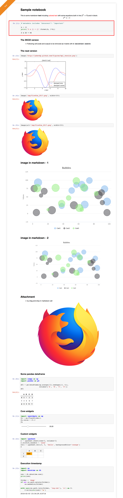

# notebook-snapshot

This is a Python package to
+ execute a notebook without opening it
    + tagging an exec with a time stamp
+ convert it to html with a number of options
    + Remove code cells
    + Selectively remove some cells
    + Outline important cells
    + Add a ribbon
    + embed images to avoid broken links
+ archive the notebook and its html snapshot

This is to help
+ use notebook as 'Excel macros'
+ share the result (only the interesting parts) as standalone documents


## 1 - Install

From terminal:

```bash
pip install notebook_snapshot
```

## 3 - User Guide

Read and run the [demo notebook](https://github.com/oscar6echo/notebook-snapshot/blob/master/demo_notebook_snapshot.ipynb).  
It will
+ run the [sample notebook](http://nbviewer.jupyter.org/github/oscar6echo/notebook-snapshot/blob/master/sample_notebook.ipynb)
+ snapshot it as html after applying custom mofications
+ move the executed notebook and its snapshot, both time stamped, to an archive folder

The configuration options are self explanatory from the demo notebook except the selection of cells
+ A code cell and its output can be tagged 'important' by
    + starting it with `# NBCONVERT IMPORTANT`
    + adding metadata `"nbconvert": "important"`
+ A code cell and its output can be tagged for removal by
    + starting it with `# NBCONVERT REMOVE`
    + adding metadata `"nbconvert": "remove"`


## 4 - Result Sample

As an example the [sample notebook](http://nbviewer.jupyter.org/github/oscar6echo/notebook-snapshot/blob/master/sample_notebook.ipynb) can be converted to




## 5 - To Do

Remove injection of notebook CSS 5.2.2 when nbconvert version goes over 5.3.1.  
Waiting for nbconvert [PR#682](https://github.com/jupyter/nbconvert/pull/682) to come into effect.  


<!-- pandoc --from=markdown --to=rst --output=README.rst README.md -->
